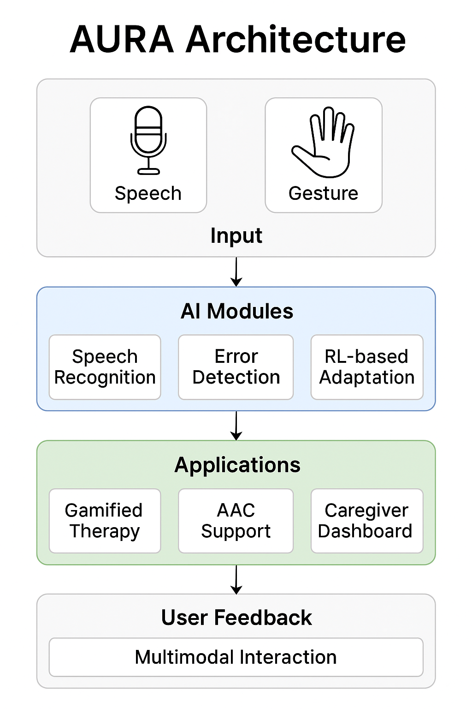

# 🧠 AURA: Adaptive Understanding and Relearning Assistant

[](https://aura-apraxia-aac-rnkcwedsqwp7nwyg9umbx7.streamlit.app/)


> AI-powered multimodal therapy assistant that integrates speech recognition, error detection, and gesture-based AAC for individuals with Apraxia of Speech and Makaton users.


[](https://aura-apraxia-aac-rnkcwedsqwp7nwyg9umbx7.streamlit.app/)



AURA is an AI-powered therapeutic platform for supporting individuals with Apraxia of Speech (AOS). It combines speech recognition, adaptive therapy, and multimodal communication tools to support personalized and accessible intervention.

## 🔧 Modules Included

| Folder                        | Description                                                  |
|-------------------------------|--------------------------------------------------------------|
| `speech_recognition/`         | Wav2Vec2-based transcription for disordered speech           |
| `error_classification/`       | CNN + BiLSTM classifier for identifying speech errors        |
| `adaptive_therapy/` (GUI + CLI) | Reinforcement logic to adapt therapy tasks dynamically       |
| `multimodal_aac_enhanced/`    | Enhanced gesture-to-speech AAC with TTS + GUI + logging      |
| `aura_streamlit_app.py`       | Streamlit web app combining all modules                      |
| `aura_launcher.py`            | CLI-based module launcher for local demo                     |
| `requirements.txt`            | Dependencies for the full app                                |
| `docs/`                       | Architecture diagrams and UML files                          |

## 📸 System Architecture

See the image above for an overview of AURA’s layered system, which includes:
- **Input:** Speech and gesture capture
- **AI Modules:** Speech recognition, error classification, RL-based adaptation
- **Applications:** Gamified therapy, AAC support, caregiver dashboard
- **User Feedback:** Real-time, multimodal interaction

### 🧠 AI Model Overview

Below is a high-level summary of the machine learning and AI techniques powering AURA:
| Component | Technique / Model | Function |
|------------|------------------|-----------|
| Speech Recognition | Wav2Vec2 (Transformers) | Converts disordered speech to text |
| Error Detection | CNN–BiLSTM | Classifies articulation and phonemic errors |
| Adaptive Therapy | Reinforcement Learning | Dynamically adjusts therapy difficulty |
| Gesture-to-Speech AAC | Mediapipe + TTS | Translates Makaton-style gestures into speech |
| Interface | Streamlit | Provides interactive multimodal feedback |


## 🚀 Quick Start

Install dependencies:

```bash
pip install -r requirements.txt
```

Launch the full app locally (menu-based):

```bash
python aura_launcher.py
```

Run the Streamlit web app:

```bash
streamlit run aura_streamlit_app.py
```

---

## 🧪 Core Functionalities

- 🎙 **Speech Recognition:** Converts speech to text using Wav2Vec2
- 🧠 **Error Classification:** Detects articulation errors using CNN + BiLSTM
- 🎯 **Adaptive Therapy:** Provides real-time task recommendations
- ✋ **Gesture AAC:** Detects signs and converts to spoken language
- 🌐 **Web Deployment:** Full prototype hosted with Streamlit Cloud

## 📚 Project Status

This is a research prototype, combining real AI models with simulated logic. It is under active development and testing with plans for iterative refinement.

## 🧠 License

MIT License – for research, non-commercial, and educational use.

## 🤝 Contributions

This is a research prototype. Contributions are welcome.

---

### 💡 Research Motivation
AURA was conceived as part of a broader research effort to build inclusive AI systems that bridge communication barriers for individuals with Apraxia of Speech (AOS) and users of Makaton — a language combining signs, symbols, and speech.
The project explores the intersection of AI-driven speech recognition, error detection, and gesture-based communication, aiming to create a seamless multimodal translation framework.
This aligns with ongoing research into how machine learning and multimodal interfaces can extend assistive communication beyond traditional therapy environments and into everyday contexts.

---

### 🌍 Accessibility Impact

- Empowers individuals with speech or motor planning difficulties to communicate through AI-assisted multimodal tools.
- Promotes early, adaptive, and remote intervention in therapeutic contexts.
- Supports inclusive education and digital accessibility for users of Makaton and related AAC systems.
- Advances the UN Sustainable Development Goals (SDG 3 – Good Health and Well-being, and SDG 10 – Reduced Inequalities) by making assistive technology scalable and research-driven.

---

### 📊 Evaluation Plan
AURA’s future evaluations will focus on both **technical performance** and **user-centered impact**:
- **Speech Accuracy:** Measure transcription and classification precision across disordered speech datasets.
- **Therapy Adaptation:** Assess response times and reinforcement effectiveness using simulated interaction data.
- **User Experience:** Conduct usability reviews with educators and speech therapists to refine multimodal feedback design.
- **System Efficiency:** Benchmark model inference and latency across devices for real-world deployment.

---

### 🔭 Future Research Directions
- Integrate **multilingual Makaton translation** for broader accessibility.
- Expand **error classification datasets** to include diverse speech conditions.
- Develop **privacy-preserving AI models** for healthcare compliance.
- Explore **Edge AI deployment** for low-power, offline therapy support.
- Investigate **cross-modal learning** between speech and gestures to improve adaptive accuracy.

---

Created by Omotayo Omoyemi
GitHub: [tayo4christ](https://github.com/tayo4christ)
