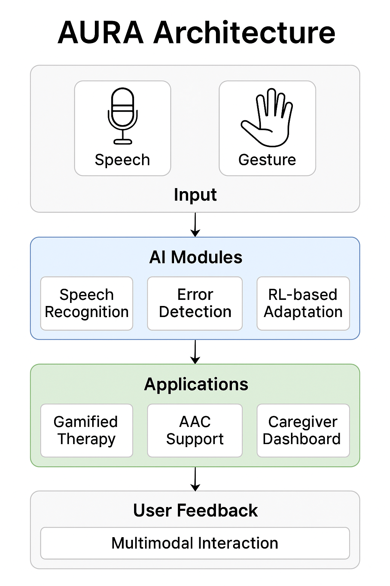

[](https://aura-apraxia-aac-a8qejouwasaqequrhetbfw.streamlit.app/)



# AURA: Adaptive Understanding and Relearning Assistant

AURA is an AI-powered therapeutic platform for supporting individuals with Apraxia of Speech (AOS). It combines speech recognition, adaptive therapy, and multimodal communication tools to support personalized and accessible intervention.

## 🔧 Modules Included

| Folder                        | Description                                                  |
|-------------------------------|--------------------------------------------------------------|
| `speech_recognition/`         | Wav2Vec2-based transcription for disordered speech           |
| `error_classification/`       | CNN + BiLSTM classifier for identifying speech errors        |
| `adaptive_therapy/` (GUI + CLI) | Reinforcement logic to adapt therapy tasks dynamically       |
| `multimodal_aac_enhanced/`    | Enhanced gesture-to-speech AAC with TTS + GUI + logging      |
| `aura_streamlit_app.py`       | Streamlit web app combining all modules                      |
| `aura_launcher.py`            | CLI-based module launcher for local demo                     |
| `requirements.txt`            | Dependencies for the full app                                |
| `docs/`                       | Architecture diagrams and UML files                          |

## 📸 System Architecture

See the image above for an overview of AURA’s layered system, which includes:
- **Input:** Speech and gesture capture
- **AI Modules:** Speech recognition, error classification, RL-based adaptation
- **Applications:** Gamified therapy, AAC support, caregiver dashboard
- **User Feedback:** Real-time, multimodal interaction

## 🚀 Quick Start

Install dependencies:

```bash
pip install -r requirements.txt
```

Launch the full app locally (menu-based):

```bash
python aura_launcher.py
```

Run the Streamlit web app:

```bash
streamlit run aura_streamlit_app.py
```

---

## 🧪 Core Functionalities

- 🎙 **Speech Recognition:** Converts speech to text using Wav2Vec2
- 🧠 **Error Classification:** Detects articulation errors using CNN + BiLSTM
- 🎯 **Adaptive Therapy:** Provides real-time task recommendations
- ✋ **Gesture AAC:** Detects signs and converts to spoken language
- 🌐 **Web Deployment:** Full prototype hosted with Streamlit Cloud

## 📚 Project Status

This is a research prototype, combining real AI models with simulated logic. It is under active development and testing with plans for iterative refinement.

## 🧠 License

MIT License – for research, non-commercial, and educational use.

## 🤝 Contributions

This is a research prototype. Contributions are welcome.

---

Created by Omotayo Omoyemi  
GitHub: [tayo4christ](https://github.com/tayo4christ)
